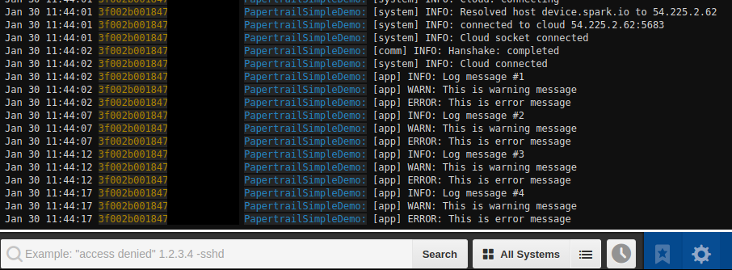

# Papertrail logging library for Particle

Ever wanted to get a log from your code without having to connect it to a PC and use Serial to debug?
This library enables Particle hardware to write log to Papertrail, and debug your application even
when it's not connected to your machine.
This library uses the existing [logging](https://docs.particle.io/reference/firmware/photon/#logging)
mechanism, so you can move to using Papertrail in minutes.
Currently, the library send the logs on UDP without any encryption. Since UDP is used, the order of the log entries in Papertrail can be different from the order of the entries sent.

## What is Papertrail?

[Papertrail](https://papertrailapp.com/) provides hosted log management. That means you can upload
any log to the cloud. Once uploaded, you can view the entire log, filter it and search it.

### Is it free?

Yes! Papertrail provides a [free plan](https://papertrailapp.com/signup?plan=free)! Use referral code `668c8a` to get an extra 50/MB/month more log volume for 1 year (and I will get as well).

## Logging format

The library uses the Particle device ID for the Papertrail system. And the application name is configurable. The log message itself follows the same pattern as the [SerialLogHandler](https://docs.particle.io/reference/firmware/photon/#logging) class.

For example a full log entry looks like this `Dec 23 00:09:09 200000000555555555555555 App:  [app] ERROR: An error occurred!`

## Compatible Hardware:

* Particle Photon, Core and Electron were verified to work with this library.

**Logging on the Electron consumes a lot of data. Be careful about how often you log.**

## Example:

1. To use the example, first you need to sign up to Papertrail.
2. Once signed up, go to Settings -> Log destinations. There you'll see your host and port. Should be something like `logs53.papertrailapp.com:12345`.
3. In the example file, replace `logsX.papertrailapp.com` with your own host, and the port (`12345`) with your own.
4. You can also replace the app name there (In this example, it was left as "PapertrailSimpleDemo").
5. Flash the application.
6. On your Papertrail dashboard, a new system will be created with your device ID. Click on it.
7. Your log should look like this:

## Contributing

Feel free to open an issue, open a PR, or to ask a question.
